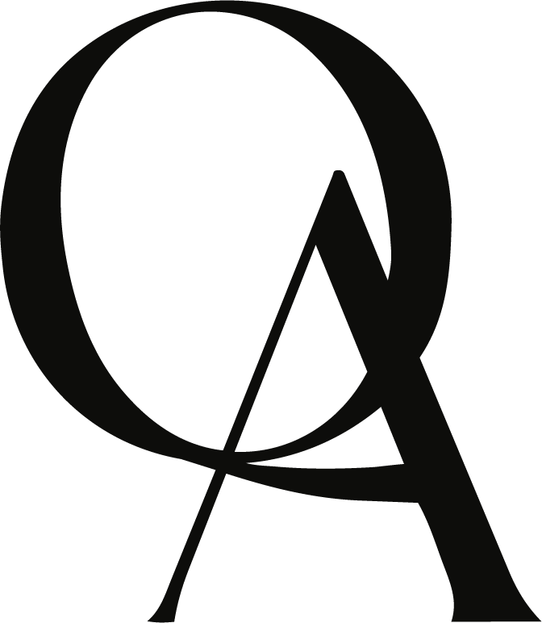

# REVISÃO TÉCNICA — SITE MARATU
> Varredura completa dos 11 HTML, 6 JS e 2 CSS + auditoria de peso de imagens.
> Data: 2026-07-12 · Revisor: Fable (Claude)

---

## 🔴 CRÍTICO

### C1. Link quebrado no 404 — `/loja.html` não existe
**`404.html:142`**
```html
<a href="/loja.html" class="btn-loja">Ver a loja ↗</a>
```
Não existe `loja.html` no projeto — a loja é a seção `#loja` da home. Quem cai no 404 e clica em "Ver a loja" cai em **outro 404** (loop de erro).
**Correção:** trocar para `href="/#loja"`.

### C2. GA4 — evento `clique_encomendar` morre após a hidratação do catálogo
**`js/tracking.js:2-4`** + **`index.html:2149`**
`tracking.js` faz binding **estático** (`querySelectorAll` + `addEventListener` no DOMContentLoaded). Mas o `hydrateCatalog()` (index.html:2010+) substitui o `innerHTML` de **todos os grids** (`grid-chaveiros`, `grid-adesivos`, `grid-blusas`, `grid-posteres`, `grid-essenciais`) quando o fetch do D1 resolve — depois do DOMContentLoaded. Resultado: todos os botões de produto perdem o listener e o evento `clique_encomendar` só dispara no link genérico de contato (como `nao_identificado`). Só o evento `wa_<slug>` (delegado, index.html:1218-1227) sobrevive.
**Correção:** converter `tracking.js` para delegação de eventos (`document.addEventListener('click', ...)` com `closest('a[href*="wa.me"]')`), igual ao listener inline do index.

### C3. Botões de blusa hardcoded sem `data-produto` (regra GA4 do projeto)
**`index.html:1425`** e **`index.html:1444`**
```html
<button type="button" onclick="abrirQaPopup()" class="btn-encomendar btn-disponivel">Disponível na </button>
```
A versão hidratada do mesmo botão (index.html:2091) **tem** `data-produto`; o fallback hardcoded não tem. Regra do projeto: todo botão de produto precisa de `data-produto` pro GA4. Se a API cair, os cliques nas blusas Azulejo Português e Maratu ficam invisíveis no tracking.
**Correção:** adicionar `data-produto="Azulejo Português"` e `data-produto="Maratu"` respectivamente.

### C4. newsletter.html carrega `foto-atalaia.jpg` de 4,1 MB tendo webp de 567 KB
**`newsletter.html:19`**
```css
.bg { ... background: url('foto-atalaia.jpg') center center / cover no-repeat; }
```
`foto-atalaia.webp` (567 KB, ~86% menor) existe no repo e já é usada no index (index.html:1474). A página de newsletter — justamente uma landing de aquisição — baixa 4,1 MB à toa.
**Correção:** trocar para `foto-atalaia.webp`.

---

## 🟡 MÉDIO

### M1. Fonte Jack fora do nome da marca (regra de tipografia)
Regra do projeto: Jack **só** no nome "MARATU".
- **`index.html:1492`** — `<span class="t2">ARACAJU</span>` renderiza em Jack (`.t2` → `var(--jack)`, index.html:513). Trocar por Clother Black ou remover Jack do `.t2` nesse bloco.
- **`newsletter.html:30` + `:63`** — `.titulo span { font-family:'Jack' }` aplica Jack na palavra **"primeiro."** do título "Descubra primeiro.". Violação direta.
- **`404.html:52` + `:132`** — o número "404" gigante usa Jack. Fora da marca (avaliar se é aceitável como display, mas pela regra é violação).
Usos corretos (ok): logo header, `hero__title` MARATU, `marca-titulo` USE/CASA MARATU, `footer__indica-titulo` MARATU, `.mark .word` MARATU no admin.

### M2. Telefone do WhatsApp inconsistente entre links
- 8× `wa.me/p/<sku>/557991957415` e `wa.me/c/557991957415` (**sem** o nono dígito) — index.html:1335, 1346, 1357, 1368, 1379, 1398, 1927, 2031
- 2× `wa.me/5579991957415` (**com** o nono dígito) — index.html:60 (JSON-LD), 1514 (contato); também ig/index.html:141
Os links `/p/` e `/c/` vêm do WhatsApp Business (formato do catálogo) e funcionam, mas o JSON-LD declara `+5579991957415` enquanto os links de produto usam outro número textual. Vale confirmar qual formato é o canônico e padronizar pelo menos os links diretos (`wa.me/NÚMERO`).

### M3. "Est. 2025" vs "EST. 2026"
**`avaliacao.html:317`** — `MARATU Estúdio · Aracaju, SE · Est. 2025`.
Todas as outras páginas (index, newsletter:75, 404:144, ig:145, login:295) dizem **2026** (e o JSON-LD tem `foundingDate: 2026`). Corrigir para 2026.

### M4. Handler de scroll do header duplicado e conflitante
**`index.html:1747-1757`** e **`index.html:1990-1996`** — dois `window.addEventListener('scroll', ...)` no mesmo script fazendo a mesma coisa com thresholds diferentes (120 vs 80). `var header`/`var lastScroll` são redeclarados. O segundo sempre roda por último e "vence" — o primeiro é código morto que executa a cada scroll.
**Correção:** deletar um dos dois blocos.

### M5. `console.log` esquecido em produção
**`index.html:1824`** — `console.log('[maratu] navegando parceiro:', url);` no fallback de clique dos parceiros. Remover.

### M6. 404.html carrega tracking com caminho relativo
**`404.html:146`** — `<script src="js/tracking.js">`. O GitHub Pages serve o 404 em **qualquer** URL (ex: `/produtos/x`), então o path relativo vira `/produtos/js/tracking.js` → 404 do script. As demais refs da página já são absolutas (`/favicon.png`, `/mangue.jpg`).
**Correção:** `src="/js/tracking.js"`.

### M7. Páginas usando só .ttf quando os .woff2 existem (~10× menores)
- **`avaliacao.html:9-12`**, **`newsletter.html:11-14`**, **`404.html:10-13`**, **`ig/index.html:14-17`** — `@font-face` só com `format('truetype')` (~170 KB por peso; 3-4 pesos ≈ 500-680 KB).
- index, login, 2fa e passkey já fazem certo: `woff2` primeiro (~18-20 KB por peso) com ttf de fallback.
**Correção:** replicar o padrão do index nessas 4 páginas.

### M8. `mangue.jpg` (816 KB) sem versão webp, usado em 3 páginas
**`avaliacao.html:34`**, **`404.html:28`**, **`ig/index.html:32`** — fundo de tela em 816 KB. Não existe `mangue.webp`. Gerar webp (deve ficar ~100-150 KB) e trocar as 3 refs.

### M9. sw.js pré-cacheia TTFs que nunca são usados
**`sw.js:9-12`** — precache de `TRYJackAlpha-Regular.ttf` + 3 `TRYClother-*.ttf` (~525 KB). login.html e admin.html declaram woff2 primeiro, então o browser nunca pede os TTFs — o precache só desperdiça banda/armazenamento na instalação do PWA.
**Correção:** trocar para os `.woff2` correspondentes (~60 KB no total).
Obs: o SW tem escopo `/` e aplica cache-first a **todas** as imagens/fontes same-origin — inclusive do site público. Pra quem usa o admin, uma imagem trocada no site (mesmo nome de arquivo) pode ficar servida da versão velha pra sempre.

### M10. Contagens de filtro hardcoded ≠ catálogo dinâmico
**`index.html:1304-1311`** — `Todos 25`, `Use MARATU 8`, `Casa MARATU 17`, `Chaveiros 5`... e os "VER TODOS (5)"/"(10)" (1323, 1457). O catálogo real vem do D1 (26 produtos, e vai mudar); `hydrateCatalog()` **não atualiza esses números**. Além disso, no modo fallback (API fora), `grid-essenciais` fica vazio mas o filtro segue oferecendo "Decor 7".
**Correção:** recalcular as contagens em JS após a hidratação (e no fallback), ou remover os números dos botões.

### M11. CSP do admin permite um host R2 divergente
**`admin.html:8`** — `img-src ... https://pub-33d995a6b2b8438fac0996c2196c8416.r2.dev`.
O R2 público do projeto é `pub-33d995a6b2b8438fac0996c21b3a13c3.r2.dev` (é o que o index pré-conecta na linha 1207 e o que consta na doc do projeto). O hash na CSP é outro — entrada morta ou errada; se algum dia o admin exibir imagem direto do R2 público, será bloqueada.
**Correção:** conferir e alinhar o host (ou remover, já que as imagens passam pelo worker `maratu-api`).

### M12. SEO incompleto na newsletter.html
**`newsletter.html:1-9`** — página indexável (sem `noindex`), com `title` e `description`, mas **sem** `og:title/og:image/og:url`, sem `canonical`, e fora do `sitemap.xml` (que só lista a home). Compartilhar o link da newsletter no WhatsApp/Instagram sai sem preview.
**Correção:** adicionar bloco OG + canonical + entrada no sitemap.

### M13. Acessibilidade — controles não acessíveis por teclado
- **`avaliacao.html:229-307`** — as "pills" de resposta são `<span>` com click handler: sem `tabindex`, sem `role`, sem suporte a Enter/Espaço. Formulário inteiro inoperável por teclado. Trocar por `<button type="button">`.
- **`index.html:1550`** e **`newsletter.html:66`** — inputs de e-mail só com placeholder, sem `<label>`/`aria-label`.
- **`index.html:1982`** — `abrirLightbox` não define `alt` na imagem ampliada (fica `alt=""` com conteúdo significativo).

### M14. Senha em texto puro no localStorage
**`login.html:404`** — `localStorage.setItem('maratu.token', pw)` grava a **senha** literal (o fluxo de passkey grava um token de sessão, login.html:439 — dois tipos de credencial na mesma chave). Qualquer XSS ou extensão maliciosa lê a senha. Idealmente o login por senha também deveria trocar a senha por um token de sessão HMAC no worker e guardar só o token.

### M15. Escape não fecha o popup da QA
**`index.html:1988`** — o handler de Escape chama `fecharLightbox()` e `fecharTamPopup()`, mas não `fecharQaPopup()`. O popup "Disponível na QA" só fecha por clique.

### M16. Tecla "G" (debug da grade) dispara enquanto se digita em inputs
**`index.html:1843-1845`** — o toggle da grid-overlay escuta `keydown` no documento sem checar `e.target`. Digitar um e-mail com "g" no campo da newsletter liga/desliga a grade de debug.
**Correção:** ignorar quando `e.target` for input/textarea (`if (/INPUT|TEXTAREA/.test(e.target.tagName)) return;`).

---

## 🟢 MENOR

### m1. CSS morto no index (≈40 seletores)
**`index.html`** — seletores definidos e sem nenhum uso no markup/JS atual, sobras de seções removidas: `.secao--preto/--azul/--laranja`, `.secao__header/__num/__titulo` (este em Jack), `.bg-laranja/.bg-areia/.bg-preto-split`, `.btn/.btn-dark/.btn-circle`, `.btn-loja/.botao-loja-divisor/.botao-loja-seta` (o botão LOJA antigo do header), `.cards-row/.card-item/.card-img/.card-num/.card-nome/.card-desc-txt`, `.fazemos-label/.fazemos-titulo`, `.div-laranja`, `.wa-wrap/.wa-banner/.wa-dot/.wa-title/.wa-desc/.wa-msg-preview`, `.faixa/.faixa-header/.faixa-tag/.faixa-nome` (Jack), `.footer__logo` (Jack), `.hero__subtitle`, `.nl-vintage__titulo`, `.pol-icon`, `.marca-iniciais`, `.vintage-badge`, `.foto-direita`. Limpar reduz o HTML (105 KB) e elimina os usos "fantasma" de Jack.

### m2. JS morto no index
- **`index.html:1736-1744`** — slideshow do `#feira-slideshow`: o elemento não existe na página; bloco nunca roda.
- **`index.html:1922-1928`** — `atualizarLink()` calcula `msg` (mensagem de WhatsApp com preço) e ignora; o parâmetro `tam` também não é usado — o href final é sempre `wa.me/c/557991957415`.

### m3. `<meta name="theme-color">` duplicada
**`index.html:26`** e **`index.html:1199`** — mesma tag duas vezes.

### m4. Preconnect para R2 sem uso
**`index.html:1207`** — preconnect a `pub-33d995a6b2b8438fac0996c21b3a13c3.r2.dev`, mas as imagens do catálogo vêm de `maratu-api.raphaelnascimento.workers.dev/img/` (index.html:2011). Ou trocar o preconnect para o worker, ou remover.

### m5. Documentação/snippet do rádio desatualizados
- **`components/radio/radio.html`** — snippet usa classes/IDs (`.maratu-radio`, `#mr-panel`, `#mr-body`, `#mr-led`, `#mr-bottom-label`) que não existem em `radio.css`/`radio.js` atuais (que esperam `#mr-btn`, `#mr-drop`, `#mr-drop-inner`).
- **`design.md`** — descreve o widget antigo (canto inferior direito, fundo dourado, labels DESLIGADO/TOCANDO) e diz que `--mono` = *Space Mono*, mas a implementação define `--mono: 'Clother'` (index.html:112).

### m6. `aratu-mascote.css` órfão
O arquivo não é referenciado por nenhum HTML — o index embute as mesmas regras inline (index.html:1200-1205). Manter só uma das cópias (risco de divergirem).

### m7. `maratu-chaveiro.png` é um JPEG disfarçado
`maratu-chaveiro.png` tem conteúdo JPEG (byte-idêntico a `maratu-chaveiro-tag.jpg`, 82 KB). Não é referenciado por nenhum código — pode remover.

### m8. ~96 MB de imagens não referenciadas no repo (de ~47 MB servidos +órfãos)
Nenhum código local referencia (top): `newsletter/stock-vista-aerea-praca-historica.jpg` (10 MB!), `Artboard 2/3/4/5@300x.png` (3,6–5,4 MB cada — as versões .webp é que são usadas), `newsletter/*.png` (3,3–4,8 MB cada), `bg-estatuas.jpg` (3,8 MB), `mockup-adesivos.png` (2,8 MB), PNGs de chaveiros/cobogós/vasos/interruptores (0,9–2,1 MB — hoje servidos pelo R2), `colecao1-*.jpg`, `img-arte/img-design.jpg`, `relogio-farol.png`, `foto-aracaju-centro.jpg`, ícones v2–v4. **Cuidado:** os PNGs de `newsletter/` podem estar hot-linkados por e-mails já enviados (Brevo) — confirmar antes de apagar. O resto é lastro de deploy/clone.

### m9. Imagens pesadas que sobraram nas páginas
- `poster-destrua.webp` **812 KB** (index.html:1852) — webp mal comprimido; re-exportar (os outros pôsteres têm 80–280 KB).
- `foto-atalaia.webp` 567 KB como fundo do "Sobre" (index.html:1474) — dá pra descer para ~250 KB.
- `Artboard 4@300x.webp` 411 KB no hero (index.html:1279); hero soma ~1,5 MB em 9 slides.
- Ícones de contato `icon-instagram/whatsapp/email/tiktok.png` têm ~1190×1190 px para renderizar a 40 px (24–46 KB cada) — redimensionar para 96–128 px.
- `logo-redondo.png` 95 KB para 48 px (404.html:135, ig:134).

### m10. Favicon inconsistente entre páginas públicas
index usa `favicon-v5.png` (16 KB, arte antiga?); newsletter/404/ig usam `favicon.png` (2,4 KB, byte-idêntico ao `favicon-v6.png` do admin/login). Duas identidades de favicon convivendo no mesmo domínio — o browser vai usar uma só por cache. Padronizar.

### m11. `manifest.webmanifest` com ícone único de 180×180
**`manifest.webmanifest`** — ambos os ícones (`any` e `maskable`) apontam para `apple-touch-icon-v5.png` 180×180. PWA espera 192×192 e 512×512 (o admin.webmanifest faz certo). Gera warning de instalabilidade no Android/Lighthouse.

### m12. Evento `wa_<slug>` dispara em botão que não é WhatsApp
**`index.html:1218-1227`** + **`index.html:2091`** — o botão hidratado das blusas ("Disponível na QA") tem classe `btn-encomendar` + `data-produto`, então o clique dispara `wa_azulejo_portugues` mesmo abrindo o popup da QA, não o WhatsApp. Se a semântica de `wa_*` for "clique pro WhatsApp", filtrar por `a[href*="wa.me"]`.

### m13. Cor fora da paleta (provável typo)
**`2fa.html:34`** e **`passkey.html:28`** — `button.danger { background:#c8451a }`. A paleta define laranja `#C8501A`; `#c8451a` parece digitação trocada (`45` vs `50`). Também aparecem `#c02c1a`, `#1a7a3a` etc. como cores utilitárias sem token.

### m14. `avaliacao.html` — variável de fonte morta e nomenclatura divergente
**`avaliacao.html:20`** — `--font-display: "Jack", ...` definida e nunca usada (nenhum elemento a referencia). A página também renomeia os tokens da paleta (`--laranja-caju`, `--preto-mangue`...) — mesmos hex, nomes diferentes do design system (`--laranja`, `--preto`).

### m15. Lixo/pequenos restos
- **`newsletter/002`** — arquivo de 1 byte (sobra de teste).
- Ícones antigos versionados órfãos: `admin-icon-*-v2/v3/v4.png`, `apple-touch-icon-v2/v3/v4/v6*.png`, `favicon-v4.png`, `apple-touch-icon-precomposed.png` (~600 KB no total).
- **`index.html:1470`** — `</section>` de fechamento do `#loja` está isolado após o fechamento do bloco CASA MARATU com linha em branco no meio (balanceado, mas fácil de quebrar em edição futura; mover pro fim do bloco com comentário `<!-- /loja -->`).

---

## RESUMO

| Severidade | Achados |
|---|---|
| 🔴 Crítico | 4 |
| 🟡 Médio | 16 |
| 🟢 Menor | 15 |
| **Total** | **35** |

### Top 5 prioridades
1. **C1** — 404 aponta pra `/loja.html` inexistente (loop de erro na cara do cliente).
2. **C2 + C3** — tracking GA4 de produto furado: `tracking.js` perde os listeners após a hidratação do catálogo e as blusas hardcoded estão sem `data-produto`.
3. **C4 + M8** — peso: newsletter baixa 4,1 MB de jpg com webp de 567 KB disponível; `mangue.jpg` (816 KB) sem webp em 3 páginas.
4. **M1** — Jack fora da marca: "ARACAJU" (index), "primeiro." (newsletter) e "404" (404.html) violam a regra de tipografia do estúdio.
5. **M2 + M3** — inconsistências de conteúdo: telefone WhatsApp em dois formatos (com/sem nono dígito) e "Est. 2025" na página de avaliação (todo o resto diz 2026).
